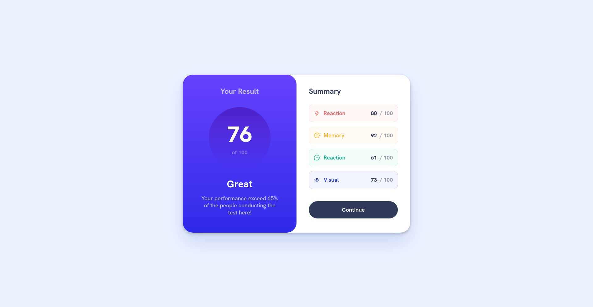
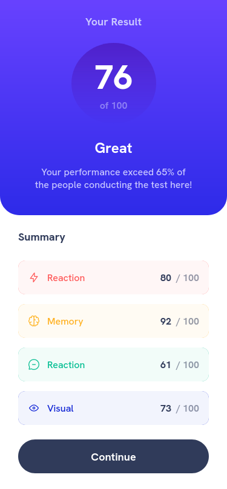

 Frontend Mentor - Results summary component solution

This is a solution to the [Results summary component challenge on Frontend Mentor](https://www.frontendmentor.io/challenges/results-summary-component-CE_K6s0maV). Frontend Mentor challenges help you improve your coding skills by building realistic projects. 

## Table of contents

- [Overview](#overview)
  - [The challenge](#the-challenge)
  - [Screenshot](#screenshot)
  - [Links](#links)
- [My process](#my-process)
  - [Built with](#built-with)
  - [What I learned](#what-i-learned)
  - [Continued development](#continued-development)
- [Author](#author)

---

## **Overview**

### **The challenge**

Users should be able to:

- View the optimal layout for the interface depending on their device's screen size
- See hover and focus states for all interactive elements on the page

### Screenshots

### **Links**

- Solution URL: [Source code](https://github.com/GuimaraesJC/results-summary-component)
- Live Site URL: [Vercel](https://results-summary-component-pi.vercel.app/)

---

## **My process**

### Built with:

- Plain HTML and CSS
- Semantic HTML5 markup
- CSS variables
- Flexbox

### **What I learned**

Since I've been working a lot with React and tools like Styled Components, I wanted to finish this challenge without any of them, so I used only plain HTML and CSS. It was good to remember some things about CSS variables, media queries without helpers and semantic HTML.

### **Continued development**

In the future, I want to try some CSS methodologies like BEM. That way, it can be more organised, although for this challenge I think it looks good.

---

## **Author**

- Website - [https//guimaraes.tech (WIP)](https://guimaraes.tech)
- Frontend Mentor - [@GuimaraesJC](https://www.frontendmentor.io/profile/GuimaraesJC)
